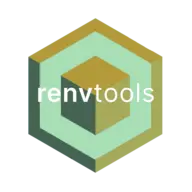

<a href="https://github.com/royfrancis/renvtools">
  
</a>

# renvtools

[](https://github.com/royfrancis/renvtools/actions?workflow=r-cmd-check) [](https://app.codecov.io/gh/royfrancis/renvtools/) [](https://lifecycle.r-lib.org/articles/stages.html#experimental)

An R package to read, write, summarize and compare renv lock files.

```r
install.packages(c("dplyr", "jsonlite", "purrr", "renv", "tibble", "tidyr", "remotes"))
remotes::install_github('royfrancis/renvtools')
```

See the [project website](http://royfrancis.github.io/renvtools) for more details.

## Disclaimer

This R package is offered free and without warranty of any kind, either expressed or implied. I will not be held liable to you for any damage arising out of the use, modification or inability to use this program. This R package can be used, redistributed and/or modified freely for non-commercial purposes subject to the original source being properly cited. Licensed under GPL-3.  

## Contact

If you have an comments, suggestions, corrections or enchancements, kindly submit an issue on the [Github issues page](https://github.com/royfrancis/renvtools/issues).  

---

2024 • Roy Francis
